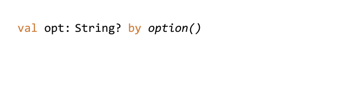

<h1 align="center">
    
    <p></p>
</h1>

Clikt *(pronounced "clicked")* is a multiplatform Kotlin library that makes writing command line
interfaces simple and intuitive. It's the "Command Line Interface for Kotlin".

It is designed to make the process of writing command line tools effortless
while supporting a wide variety of use cases and allowing advanced
customization when needed.

Clikt has:

 * arbitrary nesting of commands
 * composable, type safe parameter values
 * support for a wide variety of command line interface styles
 * multiplatform packages for JVM, NodeJS, and native Linux, Windows and MacOS 

 What does it look like? Here's a complete example of a simple Clikt program:

```kotlin
class Hello : CliktCommand() {
    val count: Int by option(help="Number of greetings").int().default(1)
    val name: String by option(help="The person to greet").prompt("Your name")

    override fun run() {
        repeat(count) {
            echo("Hello $name!")
        }
    }
}

fun main(args: Array<String>) = Hello().main(args)
```

And here's what it looks like when run:

```
 $ ./hello --count=3
 Your name: John
 Hello John!
 Hello John!
 Hello John!
```

The help page is generated for you:

```
$ ./hello --help
Usage: hello [OPTIONS]

Options:
  --count INT  Number of greetings
  --name TEXT  The person to greet
  -h, --help   Show this message and exit
```

Errors are also taken care of:

```
$ ./hello --whoops
Usage: hello [OPTIONS]

Error: no such option: "--whoops".
```

## Documentation

The full documentation can be found on [the website](https://ajalt.github.io/clikt).

There are also a number of [sample applications](samples/). You can run
them with the included [`runsample` script](runsample).

## Installation

Clikt is distributed through [Maven Central](https://search.maven.org/artifact/com.github.ajalt.clikt/clikt).

```groovy
dependencies {
   implementation("com.github.ajalt.clikt:clikt:3.2.0")
}
```


###### In version 3.0, the maven coordinates changed. Make sure you're using the new coordinates if you're updating from an older version.

###### If you're using Maven instead of Gradle, use `<artifactId>clikt-jvm</artifactId>`

#### Multiplatform

Clikt supports the following targets: `jvm`, `mingwX64`, `linuxX64`, `macosX64`, and `js` (for both
NodeJS and Browsers). [See the docs](https://ajalt.github.io/clikt/advanced/#multiplatform-support) for more
information about functionality supported on each target. You'll need to use Gradle 6 or newer.

#### Snapshots

<details>
<summary>Snapshot builds are also available</summary>
   
<a href="https://oss.sonatype.org/content/repositories/snapshots/com/github/ajalt/clikt/clikt/"></a>
   
<p>
You'll need to add the Sonatype snapshots repository: 
      
```kotlin
repositories {
    maven {
        url = uri("https://oss.sonatype.org/content/repositories/snapshots/")
    }
}
```
</p>
</details>

## License

    Copyright 2018-2021 AJ Alt

    Licensed under the Apache License, Version 2.0 (the "License");
    you may not use this file except in compliance with the License.
    You may obtain a copy of the License at

        http://www.apache.org/licenses/LICENSE-2.0

    Unless required by applicable law or agreed to in writing, software
    distributed under the License is distributed on an "AS IS" BASIS,
    WITHOUT WARRANTIES OR CONDITIONS OF ANY KIND, either express or implied.
    See the License for the specific language governing permissions and
    limitations under the License.
