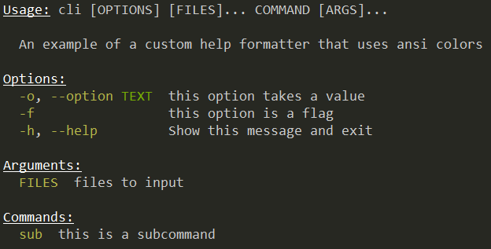

# Custom help formatter with ANSI colors

This example shows how to use a custom help formatter to add ANSI colored output to your command help.

This example uses the [mordant library](https://github.com/ajalt/mordant) for generating ANSI codes.

```
./runsample ansicolors --help
```


